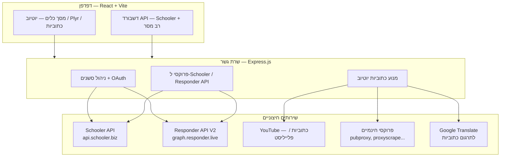
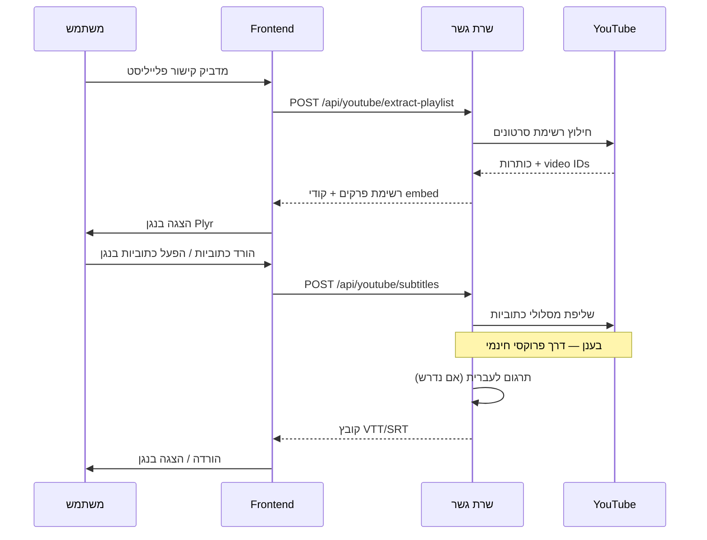
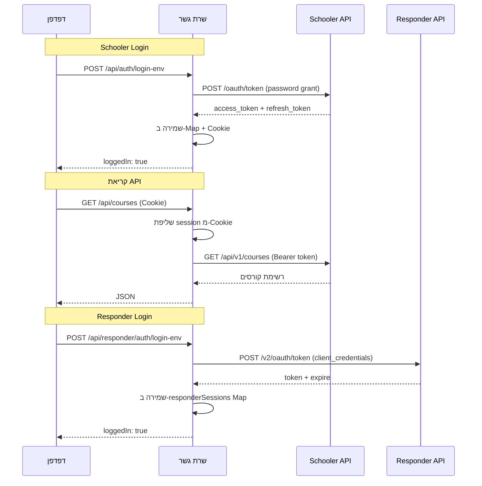

# Schooler Course Studio — מסמך הסבר ליועצים

**גרסה:** 1.0  
**תאריך:** יולי 2026  
**מטרת המסמך:** לאפשר ליועצים טכנולוגיים/עסקיים להבין מה נבנה, לאיזה צורך, ומה נדרש כדי להפוך את המערכת לשירות אונליין יציב.

---

## 1. תקציר מנהלים

**Schooler Course Studio** היא מערכת עזר ליוצרי קורסים בפלטפורמת [Schooler](https://schooler.biz) (של חברת רב מסר / Responder). המערכת מחברת בין שלושה עולמות:

1. **יוטיוב** — חילוץ פלייליסטים, צפייה, כתוביות ותרגום אוטומטי
2. **Schooler API** — ניהול קורסים, בתי ספר, סטודנטים ושיעורים
3. **רב מסר API (Responder V2)** — ניהול רשימות תפוצה ומנויים

המערכת נבנתה כיום כ**כלי עבודה מקומי** (על מחשב המפתח), עם תשתית חלקית לפריסה בענן (Vercel, Render, GitHub Pages). המטרה העסקית היא לאפשר ליוצר קורסים לבנות קורס מלא ב-Schooler מתוך פלייליסט יוטיוב — כולל כתוביות בעברית, קודי הטמעה (embed) וניהול תלמידים — בלי לעבור ידנית בין כלים שונים.

---

## 2. למי המערכת מיועדת


| קהל יעד                 | שימוש עיקרי                                                |
| ----------------------- | ---------------------------------------------------------- |
| יוצרי קורסים ב-Schooler | העלאת תוכן מיוטיוב, הכנת כתוביות, העתקת קודי embed         |
| מנהלי בתי ספר דיגיטליים | ניהול סטודנטים, הרשמה לקורסים, חיפוש תלמידים               |
| מפעילי שיווק (רב מסר)   | סנכרון רשימות תפוצה עם קורסים                              |
| מפתחים / אינטגרטורים    | בדיקה וניסוי של Schooler API ו-Responder API דרך ממשק גרפי |


**לא** מדובר כרגע במוצר SaaS רב-משתמשים עם הרשמה עצמית — אלא בכלי אישי/ארגוני שמניח שיש למפעיל גישה ל-API keys של Schooler ורב מסר.

---

## 3. בעיה עסקית שהמערכת פותרת

יוצר קורס טיפוסי ב-Schooler עובר היום תהליך ידני:

1. מעלה סרטונים ליוטיוב (או כבר יש פלייליסט)
2. מעתיק ידנית כל סרטון ל-Schooler
3. מחפש/מוריד כתוביות (אם בכלל)
4. מתרגם כתוביות לעברית (כלי חיצוני)
5. מנהל תלמידים דרך ממשק Schooler או API נפרד
6. מנהל רשימות תפוצה בנפרד ברב מסר

**המערכת מאחדת** את כל השלבים לממשק אחד בעברית, עם אוטומציה חלקית:

- חילוץ אוטומטי של כל פרקי הפלייליסט
- נגן Plyr מובנה עם כתוביות חיות
- הורדת כתוביות בפורמט VTT/SRT + תרגום אוטומטי
- יצירת קודי embed מוכנים להדבקה ב-Schooler
- דשבורד לביצוע כל פעולות ה-API הרלוונטיות

---

## 4. ארכיטקטורה טכנית

### 4.1 מבט על




### 4.2 מחסנית טכנולוגית (Tech Stack)


| שכבה        | טכנולוגיה                      | הערות                                |
| ----------- | ------------------------------ | ------------------------------------ |
| Frontend    | React 19, Vite 5               | SPA בעברית, RTL                      |
| נגן וידאו   | Plyr 3 + YouTube nocookie      | כתוביות, מהירות, איכות               |
| Backend     | Express 5, Node.js 22          | שרת גשר (BFF — Backend For Frontend) |
| HTTP Client | Axios                          | קריאות ל-APIs חיצוניים               |
| אימות       | OAuth 2.0 + Cookies            | סשן בזיכרון השרת                     |
| כתוביות     | youtube-transcript + scraping  | עם fallback לפרוקסי                  |
| תרגום       | Google Translate (לא רשמי)     | תרגום cue-by-cue של VTT              |
| Lint        | Oxlint                         |                                      |
| פריסה       | Vercel / Render / GitHub Pages | תצורות קיימות בפרויקט                |


### 4.3 מבנה תיקיות עיקרי

```
schooler/
├── server.js              # שרת Express — כל ה-API + לוגיקת כתוביות
├── api/index.js           # עטיפה ל-Vercel Serverless
├── lib/                   # לוגיקה צד-שרת (OAuth, כתוביות, פרוקסי)
├── src/
│   ├── App.jsx            # מסך ראשי — מעבר בין "כלים" ל"דשבורד API"
│   ├── components/
│   │   ├── PlyrPlayer.jsx       # נגן + כתוביות חיות
│   │   ├── ApiDashboard.jsx     # דשבורד Schooler + רב מסר
│   │   └── dashboard/           # מנוע הרצת פעולות API
│   ├── constants/         # הגדרות פעולות API (Schooler + Responder)
│   └── utils/             # לקוחות API, cache כתוביות, embed
├── scripts/               # בדיקת OAuth מהטרמינל
├── vercel.json            # פריסת Vercel (frontend + serverless API)
├── render.yaml            # פריסת Render (שרת מלא)
└── .env.example           # משתני סביבה נדרשים
```

---

## 5. מודולים ויכולות

### 5.1 מודול "כלים" — דשבורד יוטיוב קורסים

**זרימת עבודה:**




**יכולות:**

- חילוץ פלייליסט יוטיוב לרשימת פרקים ממוספרים
- נגן Plyr עם YouTube nocookie (פרטיות)
- כתוביות חיות בנגן — עם prefetch ו-cache בדפדפן
- הורדת כתוביות לפרק בודד או לכל הפלייליסט
- תרגום אוטומטי (מקור → עברית / שפות נוספות)
- פורמטים: VTT, SRT
- יצירת קודי embed (Plyr + קישור Schooler) להעתקה
- ייצוא JSON של כל הפרקים עם מטא-דאטה

### 5.2 מודול "דשבורד API"

ממשק גרפי לביצוע פעולות מול שני APIs:

#### Schooler API (`api.schooler.biz`)

כ-20 פעולות מוגדרות מראש, בקבוצות:


| קבוצה       | דוגמאות פעולות                                       |
| ----------- | ---------------------------------------------------- |
| קורסים      | רשימה, פרטים, שיעורים, סטודנטים, הרשמה, עדכון, הסרה  |
| בתי ספר     | רשימה, פרטים, סטודנטים, הרשמה, עדכון                 |
| סטודנטים    | חיפוש, איפוס IP, שליחת גישה, קישור אישי, הפעלה/השבתה |
| מותאם אישית | קריאת proxy לכל endpoint ב-Swagger                   |


**אימות Schooler:**

- `grant_type=password` עם User ID (אימייל) + User Secret (מפתח API)
- Client ID + Client Secret (מתקבלים מתמיכת Schooler — נפרדים מרב מסר)
- רענון טוקן אוטומטי עם `refresh_token`

#### Responder API V2 (`graph.responder.live`)

כ-15 פעולות, בקבוצות:


| קבוצה       | דוגמאות פעולות                 |
| ----------- | ------------------------------ |
| רשימות      | רשימת רשימות תפוצה, פרטי רשימה |
| מנויים      | חיפוש, הוספה, עדכון, מחיקה     |
| מותאם אישית | proxy לכל endpoint             |


**אימות Responder:**

- `grant_type=client_credentials` עם Client ID + Secret + User Token
- User Token מהגדרות חשבון רב מסר (חיבורים חיצוניים)

#### תכונות דשבורד

- התחברות אוטומטית ממשתני סביבה (`.env`)
- בוחן קורסים — בחירת קורס ומילוי אוטומטי של מזהים בפעולות
- קישור לפרקי פלייליסט שחולצו במסך הכלים
- מנוע `OperationRunner` — טפסים דינמיים לפי סכמת כל פעולה
- תצוגת תוצאות JSON מעוצבת

---

## 6. מודל אבטחה נוכחי


| נושא                | מצב נוכחי                                                                | סיכון                             |
| ------------------- | ------------------------------------------------------------------------ | --------------------------------- |
| אחסון credentials   | משתני סביבה בשרת (`.env`)                                                | בינוני — תלוי בהגנת השרת          |
| סשן משתמש           | Map בזיכרון + Cookie `httpOnly`                                          | **גבוה בענן** — אובד ב-cold start |
| חשיפת secrets ללקוח | לא — הכל עובר דרך שרת הגשר                                               | נמוך                              |
| CORS                | רשימה לבנה: localhost, vercel.app, onrender.com, github.io, schooler.biz | בינוני                            |
| HTTPS               | נאכף ב-production (secure cookies)                                       | תקין בפריסה נכונה                 |
| הרשאות API          | טוקני OAuth של המפעיל בלבד                                               | תקין — אין הרשאות מעבר לחשבון     |


**עקרון:** המערכת היא **proxy מאובטח** — הדפדפן לא רואה את ה-secrets, אבל גם אין הפרדה בין משתמשים.

---

## 7. מצב פריסה נוכחי

### 7.1 פיתוח מקומי (מצב עבודה ראשי)

```bash
npm install
npm start          # מפעיל API (:3030) + Frontend (:5173) במקביל
```

### 7.2 אפשרויות ענן שכבר מוגדרות בקוד


| פלטפורמה         | מה מגיש                          | קובץ תצורה                           | מגבלות ידועות                                         |
| ---------------- | -------------------------------- | ------------------------------------ | ----------------------------------------------------- |
| **Vercel**       | Frontend (dist) + API Serverless | `vercel.json`, `api/index.js`        | Timeout 60 שניות; סשנים לא נשמרים; כתוביות דרך פרוקסי |
| **Render**       | שרת Node מלא + static files      | `render.yaml`                        | Free tier — sleep אחרי חוסר פעילות; סשנים בזיכרון     |
| **GitHub Pages** | Frontend בלבד                    | `.github/workflows/deploy-pages.yml` | **דורש API נפרד** — `VITE_API_BASE`                   |


### 7.3 משתני סביבה נדרשים

```env
# שרת
PORT=3030
FRONTEND_ORIGIN=https://your-domain.com
NODE_ENV=production

# Schooler
SCHOOLER_USER_ID=your@email.com
SCHOOLER_USER_SECRET=...
SCHOOLER_CLIENT_ID=...
SCHOOLER_CLIENT_SECRET=...

# רב מסר
RESPONDER_CLIENT_ID=...
RESPONDER_CLIENT_SECRET=...
RESPONDER_USER_TOKEN=...

# כתוביות יוטיוב (ענן)
USE_PUBPROXY=true
PUBPROXY_API_KEY=          # אופציונלי
YOUTUBE_PROXY_URL=         # אופציונלי — פרוקסי ייעודי
```

---

## 8. אתגרים מרכזיים למעבר אונליין

### 8.1 אחסון סשנים (קריטי)

**הבעיה:** טוקני OAuth של Schooler ו-Responder נשמרים ב-`Map()` בזיכרון השרת. בכל:

- הפעלה מחדש של השרת
- Cold start ב-Vercel Serverless
- Scale-out ליותר מ-instance אחד

הסשן **נעלם** והמשתמש צריך להתחבר מחדש.

**שאלה ליועצים:** Redis? Database? JWT stateless עם refresh token בצד לקוח?

### 8.2 כתוביות יוטיוב בענן (קריטי)

**הבעיה:** YouTube חוסם בקשות מ-IP של שרתי ענן. הפתרון הנוכחי:

- שימוש בפרוקסי חינמיים (pubproxy, proxyscrape, floppydata, geoxy)
- ניסיונות מקביליים (batch של 4)
- Fallback לשליפה מהדפדפן (`browserCaptions.js`) — עובד רק מקומית

**שאלה ליועצים:** האם להשקיע בפרוקסי ייעודי (Bright Data, ScraperAPI)? שירות צד שלישי לכתוביות? הרצת worker נפרד?

### 8.3 timeout בפונקציות Serverless

הורדת כתוביות לפלייליסט שלם (עשרות סרטונים) עלולה לחרוג מ-60 שניות ב-Vercel.

**שאלה ליועצים:** Queue (BullMQ / SQS)? Worker ארוך-טווח? Render/Railway במקום Serverless?

### 8.4 מודל רב-משתמשים

כרגע אין:

- הרשמה / התחברות משתמשים
- הפרדה בין חשבונות Schooler שונים
- ניהול הרשאות

**שאלה ליועצים:** האם זה כלי אישי (single-tenant) או מוצר SaaS (multi-tenant)?

### 8.5 תרגום כתוביות

התרגום משתמש ב-Google Translate לא רשמי (scraping). אין SLA, אין הגבלת קצב מנוהלת.

**שאלה ליועצים:** Google Cloud Translation API? DeepL? להשאיר כפי שזה?

### 8.6 עלויות תפעול


| רכיב                         | עלות משוערת                   |
| ---------------------------- | ----------------------------- |
| Hosting (Vercel/Render free) | $0 (עם מגבלות)                |
| Hosting production           | $7–25/חודש                    |
| פרוקסי ייעודי ליוטיוב        | $50–200/חודש                  |
| Redis (Upstash)              | $0–10/חודש                    |
| תרגום (Google Cloud)         | לפי שימוש (~$20/מיליון תווים) |


---

## 9. תרשים זרימת נתונים — אימות




---

## 10. API Endpoints — סיכום

### כללי / בריאות


| Method | Path          | תיאור                          |
| ------ | ------------- | ------------------------------ |
| GET    | `/api/health` | בדיקת זמינות + גרסה + features |


### Schooler Auth


| Method | Path                  | תיאור            |
| ------ | --------------------- | ---------------- |
| GET    | `/api/auth/config`    | האם `.env` מוכן  |
| GET    | `/api/auth/status`    | מצב התחברות      |
| POST   | `/api/auth/login`     | התחברות ידנית    |
| POST   | `/api/auth/login-env` | התחברות מ-`.env` |
| POST   | `/api/auth/refresh`   | רענון טוקן       |
| POST   | `/api/auth/logout`    | ניתוק            |


### Schooler Data


| Method | Path                       | תיאור                     |
| ------ | -------------------------- | ------------------------- |
| GET    | `/api/courses`             | רשימת קורסים              |
| GET    | `/api/courses/:id`         | פרטי קורס                 |
| GET    | `/api/courses/:id/lessons` | שיעורי קורס               |
| GET    | `/api/schools`             | רשימת בתי ספר             |
| GET    | `/api/schools/:id`         | פרטי בית ספר              |
| GET    | `/api/students/search`     | חיפוש סטודנט              |
| POST   | `/api/proxy`               | קריאה מותאמת לכל endpoint |


### Responder (מקביל — תחת `/api/responder/...`)


| Method   | Path                                | תיאור        |
| -------- | ----------------------------------- | ------------ |
| GET/POST | `/api/responder/auth/*`             | אימות        |
| GET      | `/api/responder/lists`              | רשימות תפוצה |
| GET      | `/api/responder/subscribers/search` | חיפוש מנוי   |
| POST     | `/api/responder/proxy`              | קריאה מותאמת |


### YouTube


| Method | Path                                     | תיאור                |
| ------ | ---------------------------------------- | -------------------- |
| POST   | `/api/youtube/extract-playlist`          | חילוץ פלייליסט       |
| GET    | `/api/youtube/subtitles/:videoId/tracks` | מסלולי כתוביות       |
| POST   | `/api/youtube/subtitles`                 | הורדת כתוביות לסרטון |
| POST   | `/api/youtube/subtitles/bulk`            | הורדה מרובה          |
| POST   | `/api/youtube/subtitles/translate`       | תרגום                |
| POST   | `/api/youtube/subtitles/prefetch`        | טעינה מוקדמת לנגן    |
| POST   | `/api/youtube/caption-tracks`            | מטא-דאטה למסלולים    |


---

## 11. שאלות ממוקדות ליועצים

### ארכיטקטורה

1. **Vercel Serverless vs. שרת מלא (Render/Railway/Fly.io)** — מה מתאים יותר לעומס של כתוביות + סשנים?
2. האם לפצל ל-**שני שירותים** (frontend סטטי + API backend) או להשאיר monolith?
3. האם כדאי **Worker נפרד** לעיבוד כתוביות (queue-based)?

### אחסון ומצב (State)

1. **Redis** (Upstash) לסשנים — מספיק? או DB מלא (PostgreSQL)?
2. האם לשמור **refresh tokens מוצפנים** ב-DB במקום בזיכרון?
3. Cache לכתוביות מתורגמות — **Redis / S3 / local disk**?

### אבטחה

1. האם מספיק `.env` בשרת, או נדרש **vault** (Vercel Secrets, AWS SSM)?
2. האם צריך **אימות משתמשים** (Google OAuth / magic link) מעל ל-Schooler OAuth?
3. מדיניות CORS — להגביל לדומיין ספציפי בלבד?

### יוטיוב וכתוביות

1. **פרוקסי ייעודי** vs. שירות כתוביות (Supadata, youtube-transcript-api מנוהל)?
2. האם **yt-dlp** על worker VPS הוא פתרון יציב יותר?
3. SLA רצוי לזמן שליפת כתוביות — מה סביר?

### עסקי

1. **Single-tenant** (כלי אישי לכל יוצר קורס) vs. **Multi-tenant SaaS**?
2. מודל תמחור אפשרי — חינם / freemium / מנוי חודשי?
3. האם יש ערך באינטגרציה **ישירה בתוך Schooler** (plugin / iframe)?

### תפעול

1. ניטור (Sentry, Datadog) — מה מינימלי?
2. CI/CD — GitHub Actions מספיק?
3. גיבויים — מה בכלל צריך לגבות?

---

## 12. אפשרויות פריסה מומלצות (טיוטה לדיון)

### אפשרות א׳ — MVP אונליין מהיר (עלות נמוכה)

```
Frontend + API → Render (Web Service, $7/חודש)
Sessions      → Upstash Redis (free tier)
Secrets       → Render Environment Variables
YouTube       → פרוקסי חינמי (מצב נוכחי) + fallback
```

**יתרונות:** פשוט, זול, קוד קיים כמעט ללא שינוי  
**חסרונות:** כתוביות לא אמינות, אין scale אוטומטי

### אפשרות ב׳ — Production יציב

```
Frontend      → Vercel / Cloudflare Pages (CDN)
API           → Railway / Fly.io (always-on container)
Worker        → BullMQ + Redis — עיבוד כתוביות ברקע
Sessions      → Redis
Subtitles     → פרוקסי ייעודי (Bright Data) או yt-dlp worker
Translation   → Google Cloud Translation API
Monitoring    → Sentry
```

**יתרונות:** אמין, scalable, SLA סביר  
**חסרונות:** עלות ~$100–300/חודש, דורש פיתוח נוסף

### אפשרות ג׳ — Single-tenant (כלי אישי)

```
Docker Compose על VPS אחד (Hetzner ~€5/חודש)
.env מקומי, ללא Redis, ללא multi-user
```

**יתרונות:** שליטה מלאה, פשוט, זול  
**חסרונות:** לא SaaS, דורש תחזוקה ידנית

---

## 13. תלויות חיצוניות ומגבלות API


| שירות            | תיעוד                                                                  | מגבלות ידועות                                 |
| ---------------- | ---------------------------------------------------------------------- | --------------------------------------------- |
| Schooler API     | [Swagger](https://app.swaggerhub.com/apis/Responder/SchoolerAPI/1.0.0) | Client ID נפרד מתמיכה; rate limits לא מתועדים |
| Responder API V2 | [Swagger](https://app.swaggerhub.com/apis/Responder/responder/V2.0)    | User Token + Client credentials               |
| YouTube          | לא רשמי (scraping)                                                     | חסימת IP, שינויי פורמט                        |
| Google Translate | לא רשמי                                                                | חסימה אפשרית, אין SLA                         |


**קשר לתמיכה:** [support@responder.co.il](mailto:support@responder.co.il) — לקבלת Client ID/Secret ל-Schooler API.

---

## 14. מפת דרכים אפשרית


| שלב                   | תוכן                            | מאמץ משוער |
| --------------------- | ------------------------------- | ---------- |
| **1. MVP אונליין**    | פריסה ל-Render + Redis לסשנים   | 2–3 ימים   |
| **2. כתוביות יציבות** | פרוקסי ייעודי / worker          | 3–5 ימים   |
| **3. אימות משתמשים**  | login למערכת עצמה               | 5–7 ימים   |
| **4. Multi-tenant**   | הפרדת חשבונות, billing          | 2–4 שבועות |
| **5. אוטומציה מלאה**  | "צור קורס מפלייליסט" בלחיצה אחת | 1–2 שבועות |


---

## 15. נספח — פקודות שימושיות

```bash
# פיתוח מקומי
npm install
npm start                    # API + Frontend

# בדיקת OAuth
npm run schooler:oauth       # בדיקת Schooler credentials
npm run responder:oauth      # בדיקת Responder credentials

# בנייה לפרודקשן
npm run build                # בניית frontend ל-dist/
NODE_ENV=production node server.js   # שרת מלא עם static files

# Lint
npm run lint
```

---

## 16. סיכום

**Schooler Course Studio** היא מערכת עבודה מקיפה ליוצרי קורסים ב-Schooler, המאחדת כלים ליוטיוב (פלייליסט, נגן, כתוביות, תרגום) עם דשבורד מלא ל-Schooler API ו-Responder API. הקוד בנוי היטב עם הפרדה ברורה בין frontend, שרת גשר וספריות לוגיקה, וכולל תצורות פריסה ל-Vercel, Render ו-GitHub Pages.

**הפער המרכזי לאונליין:** אחסון סשנים (זיכרון → persistent store), אמינות כתוביות יוטיוב בענן (פרוקסי חינמי → פתרון יציב), והחלטה אסטרטגית על מודל עסקי (כלי אישי vs. SaaS).

---

*מסמך זה נוצר אוטומטית מתוך קוד המקור. לשאלות טכניות: עיינו ב-`server.js`, `src/App.jsx`, ו-`.env.example`.*